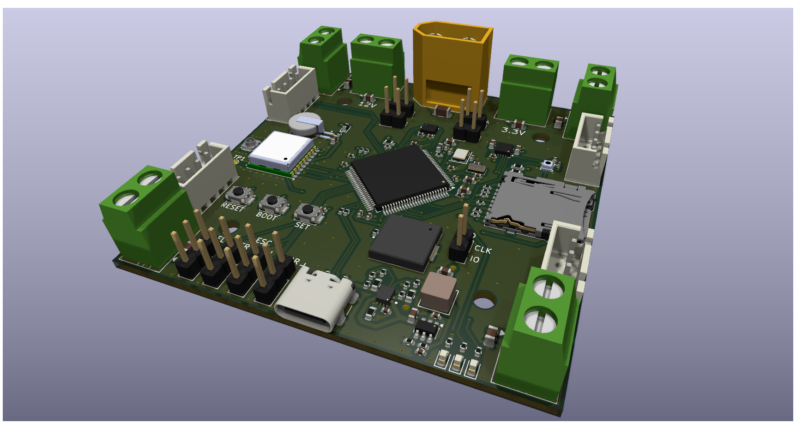

# Custom Flight Controller

A custom flight controller with IMU sensors for orientation, a GPS module, a Micro SD card slot, and support for my LoRa Transceiver module for telemetry along with a custom flight controller algorithm.
I built this for my project of creating a custom drone from scratch. 

## Usage
To use plug in a 3 cell lipo battery into the XT60 connector and attach the ESCs to the 4 corner screw terminals. Then plug in the ESC headers into the coresponding ESC headers on the board. 
Make sure a GPS antenna is connected to the U.FL connector.
A Micro SD card is not strictly required but if inserted the board will log data and error logs. 

## BOM
The full bom from digikey is in the digikey-bom.csv file in production.
| PCB Assembly        | JLCPCB  | 96.10 | jlcpcb.com                                         |
|---------------------|---------|-------|----------------------------------------------------|
| Hand Soldered Parts | Digikey | 65.80 | https://www.digikey.com/en/mylists/list/OHMGL71TDV |
